# Estelar

## Sobre o Projeto

Estelar é um aplicativo educacional desenvolvido como projeto de conclusão de curso, focado em facilitar o aprendizado da Astronomia. O aplicativo é composto por três principais funcionalidades: Jornada Astronômica, Preparatório para a OBA e Ambiente Virtual.

### Jornada Astronômica

Na "Jornada Astronômica", o usuário avança por níveis que contêm quizzes sobre temas astronômicos. Cada usuário inicia com três vidas e pode ganhar estrelas ao responder corretamente as perguntas, que podem ser utilizadas para adquirir mais vidas. Cada questão possui um limite de tempo de 60 segundos para resposta, adicionando um elemento dinâmico e desafiador ao aprendizado.

### Preparatório para a OBA

O "Preparatório para a OBA" permite aos usuários praticar com questões de edições anteriores da Olimpíada Brasileira de Astronomia (OBA). As questões são apresentadas com seus respectivos gabaritos, permitindo um feedback imediato e eficaz para o estudo. Em futuras versões, cada questão errada apresentará comentários detalhados explicando o erro para reforçar o aprendizado.

### Ambiente Virtual

O "Ambiente Virtual" oferece uma exploração educativa dos planetas do sistema solar. Nesta modalidade, os usuários podem optar por visualizar os planetas em realidade aumentada, sendo redirecionados para o site Estelar AR, onde a experiência se torna ainda mais imersiva.

## Futuras Implementações

Diversas melhorias estão planejadas para serem implementadas no Estelar para enriquecer a experiência do usuário e expandir as funcionalidades do aplicativo

### Sistema de Recuperação de Vidas

Um sistema de recuperação de vidas será introduzido, onde os corações se regenerarão após um período de tempo determinado, permitindo uma jogabilidade contínua e balanceada.

### Suporte a Realidade Aumentada para iOS

A funcionalidade de realidade aumentada será estendida para dispositivos iOS, ampliando o acesso e a usabilidade da aplicação.

### Guia Interativo para a Realidade Aumentada

Desenvolverei um guia interativo que ensinará os usuários a manipular os planetas na realidade aumentada, incluindo instruções para girar, aproximar e explorar os planetas de forma mais intuitiva e educativa.

### Feedback Detalhado para Questões Erradas no Preparatório da OBA

Implementaremos um recurso de feedback detalhado para cada questão respondida incorretamente no preparatório da OBA, fornecendo comentários explicativos para ajudar o usuário a entender melhor os conceitos e melhorar seu desempenho em tentativas futuras.

## Telas da Aplicação

### Login/Cadastro

<div> 

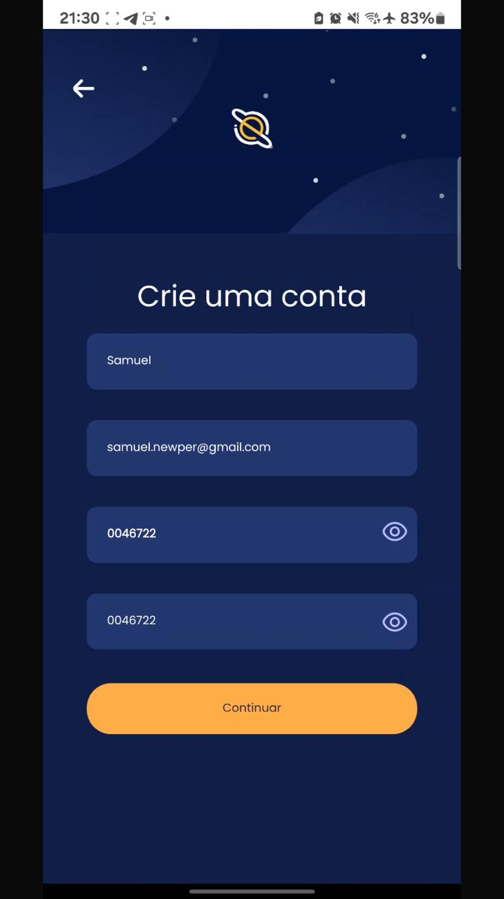

</div>

### Edição de perfil

<div> 
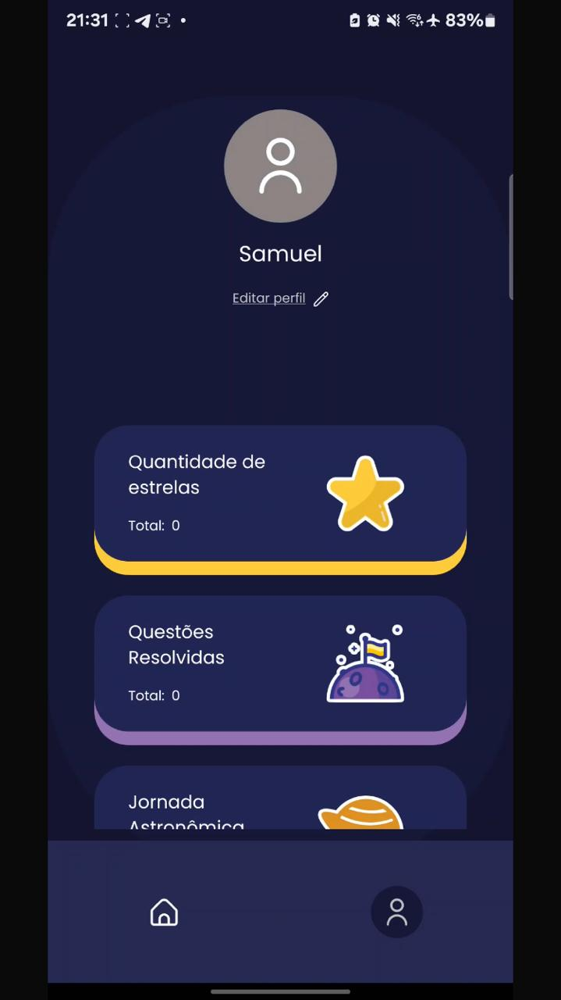
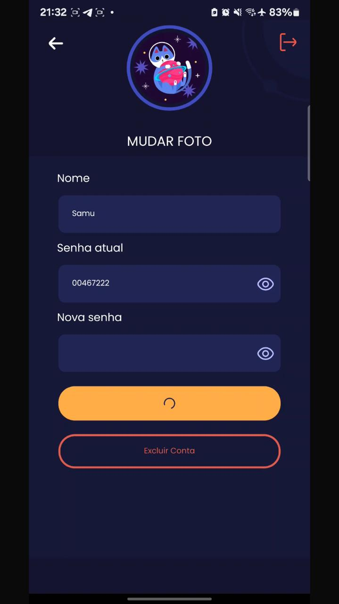
</div>

### Jornada Astronômica

<div> 
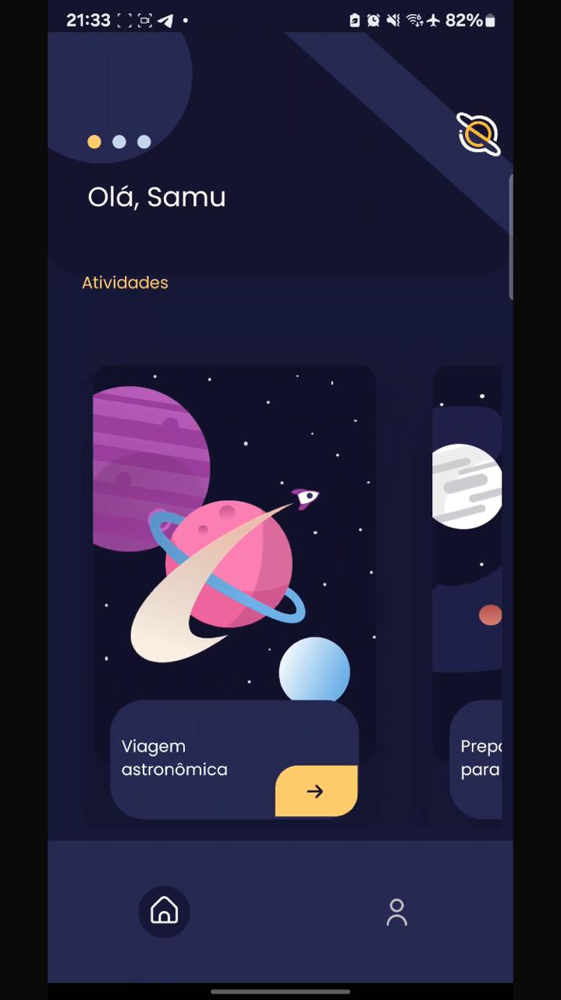
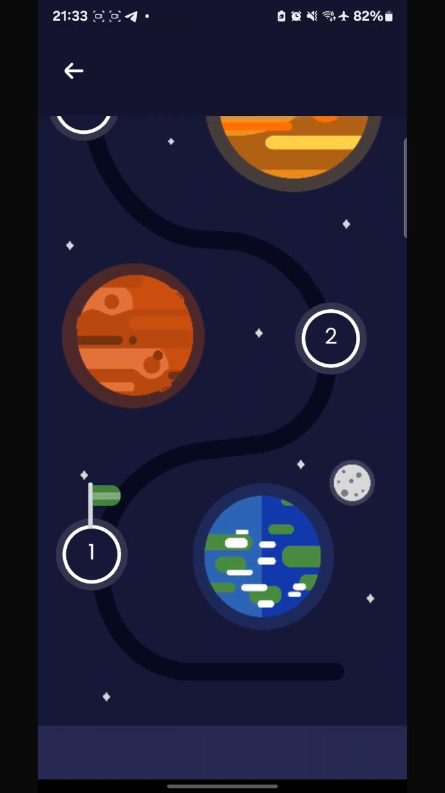
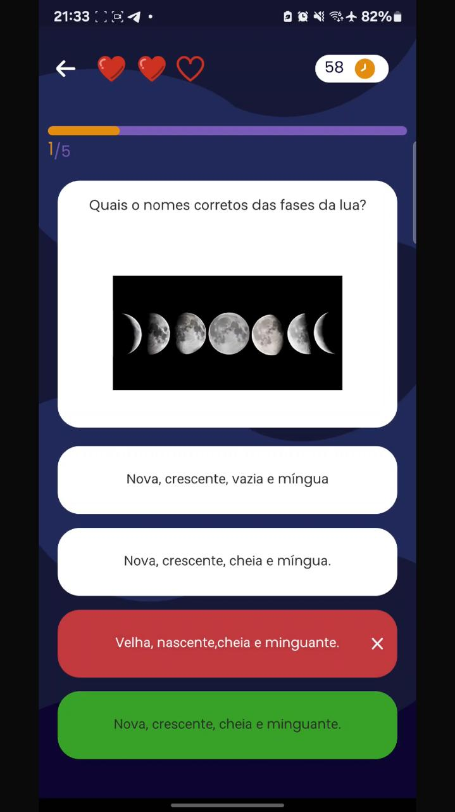

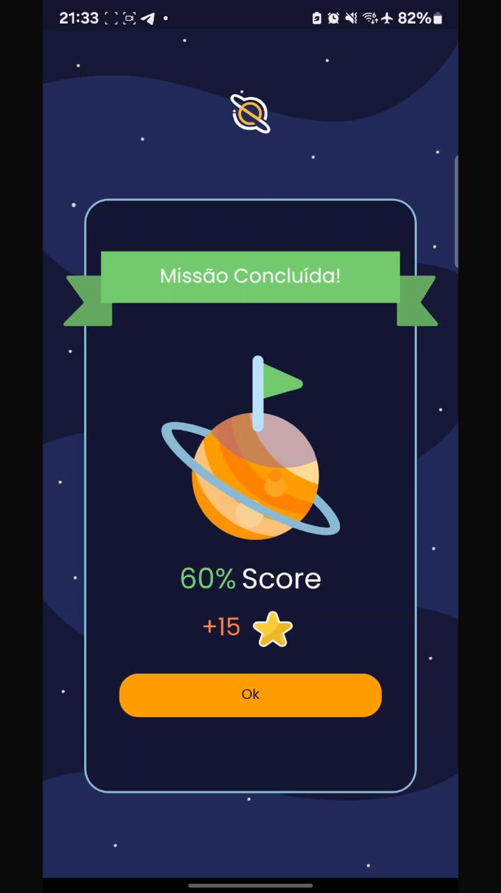
</div>

### Preparatório da OBA

<div> 
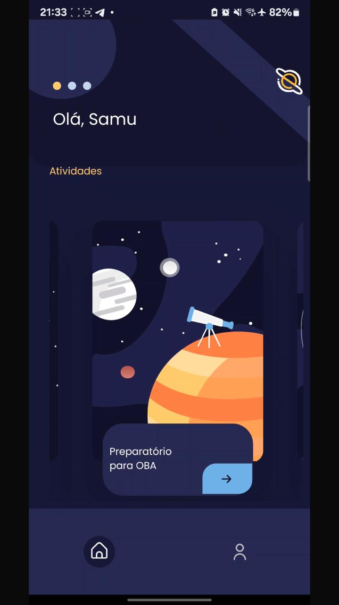
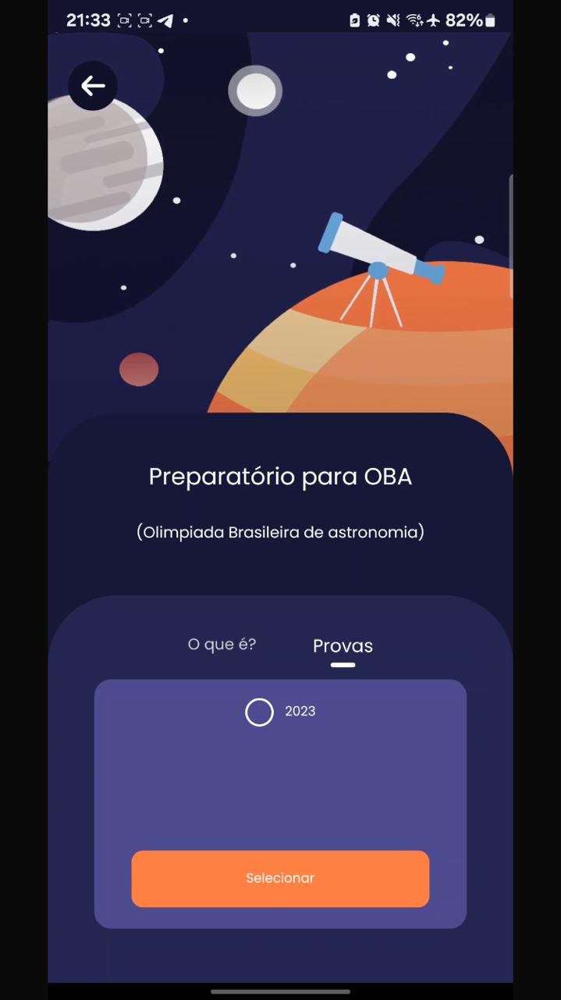
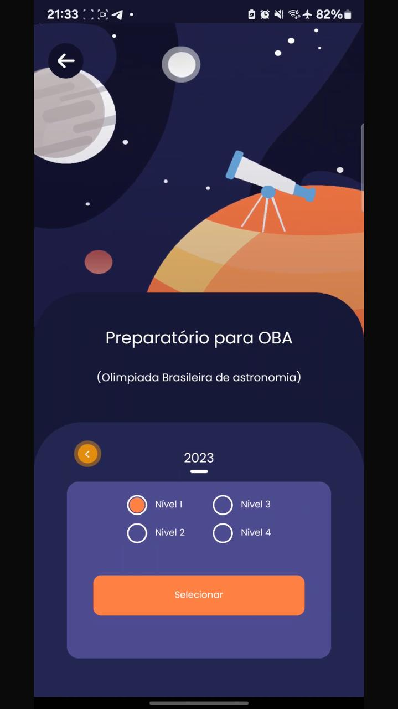
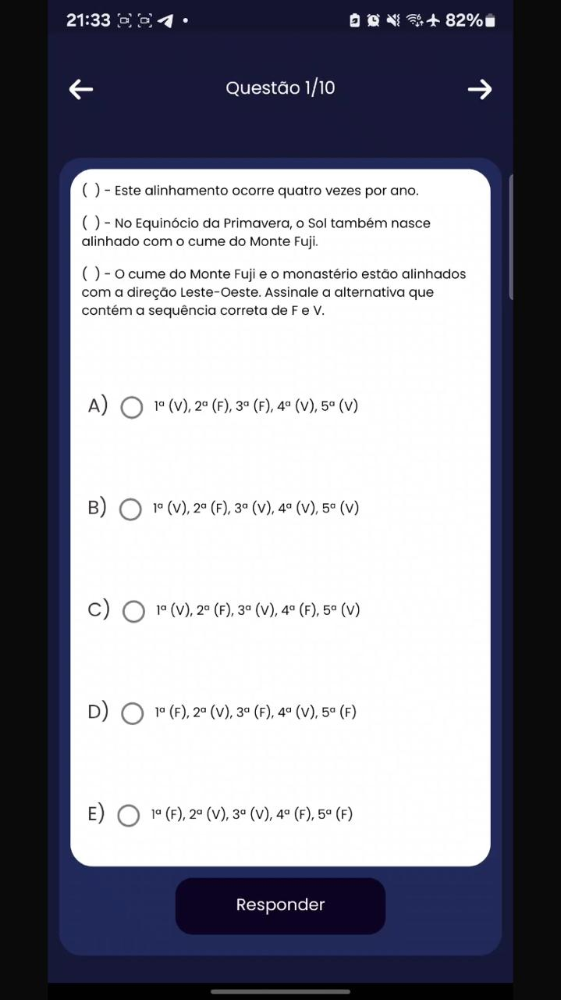
</div>

### Ambiente Virtual

<div> 
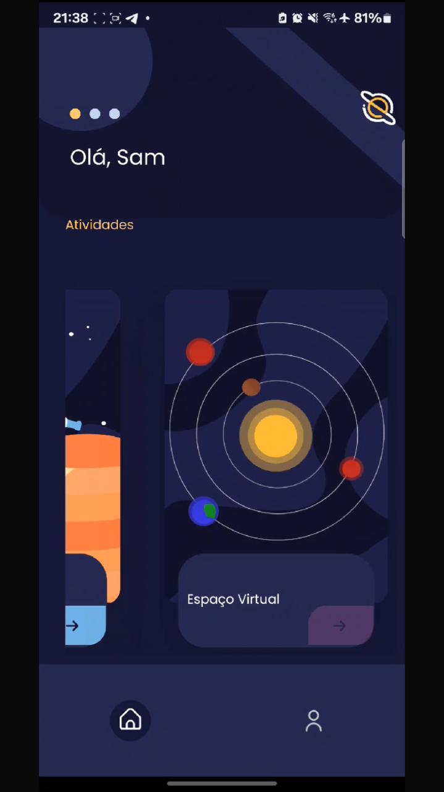
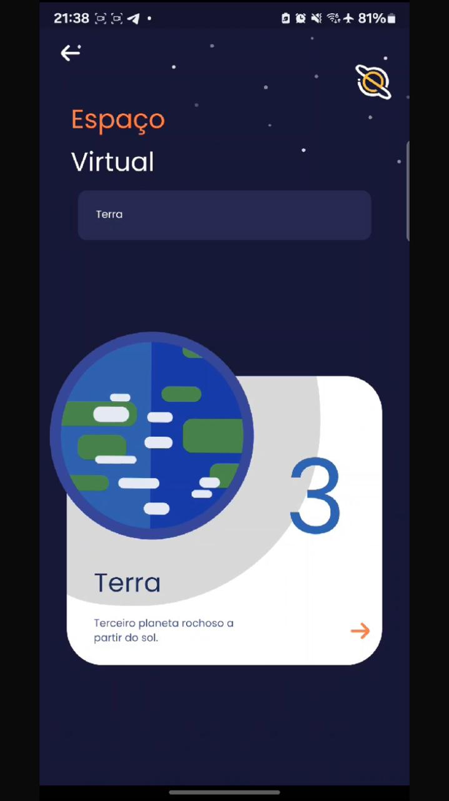
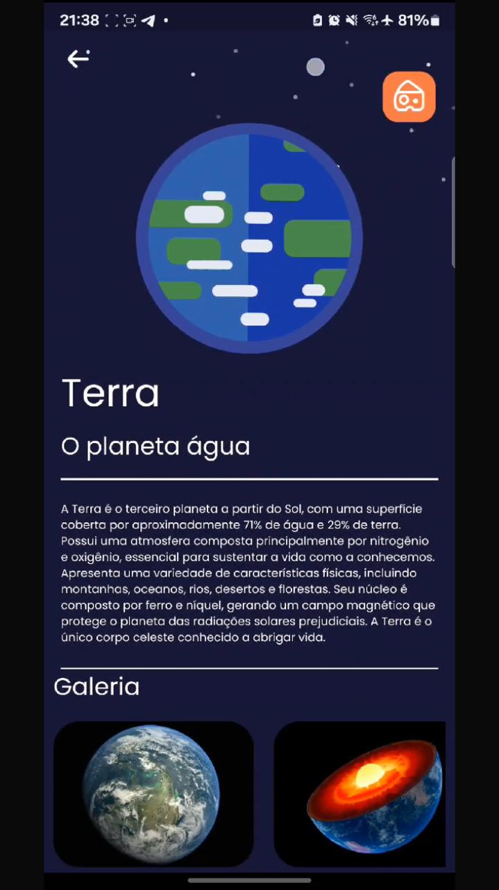
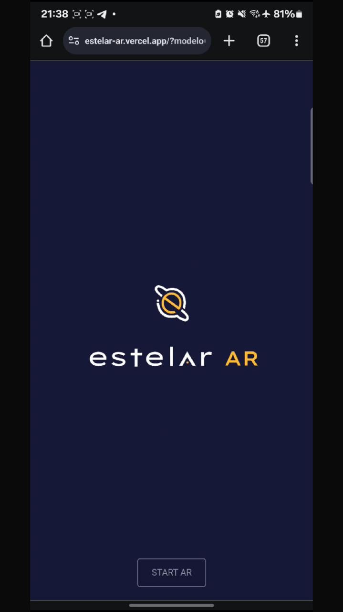
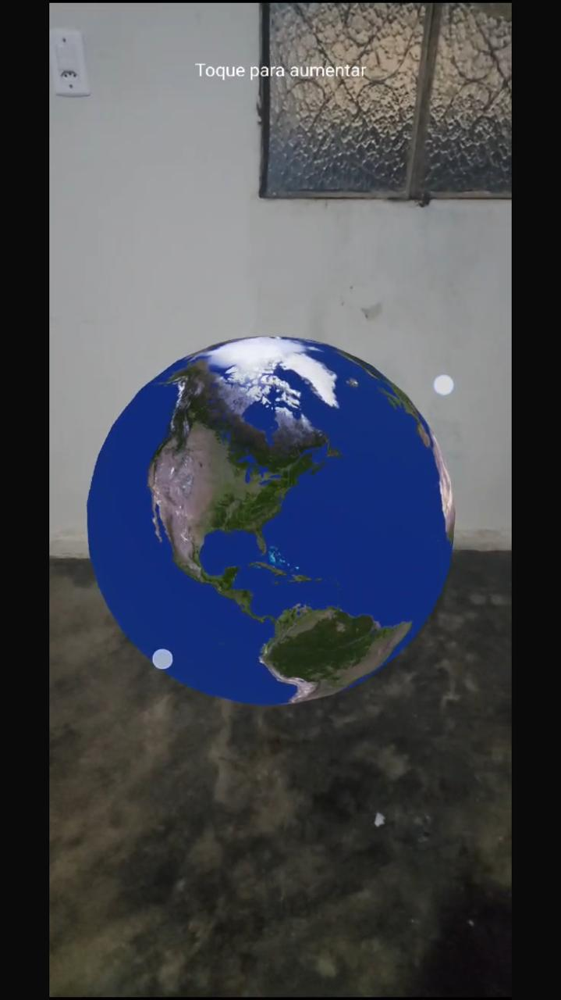
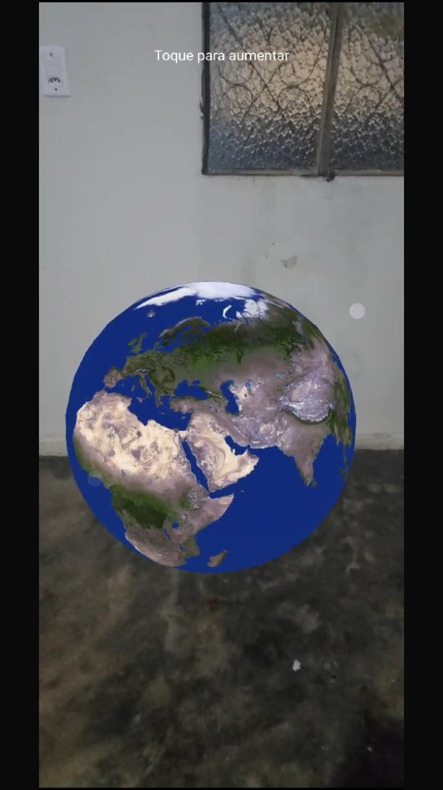 
</div>


## Tecnologias Utilizadas

- 
- 
- 
- 
- 


## Instalação

Para configurar o ambiente de desenvolvimento e iniciar o aplicativo, execute os seguintes comandos:

```bash
git clone https://github.com/SamuelNzz1/Estelar.git
cd Estelar
npm install
npm start
